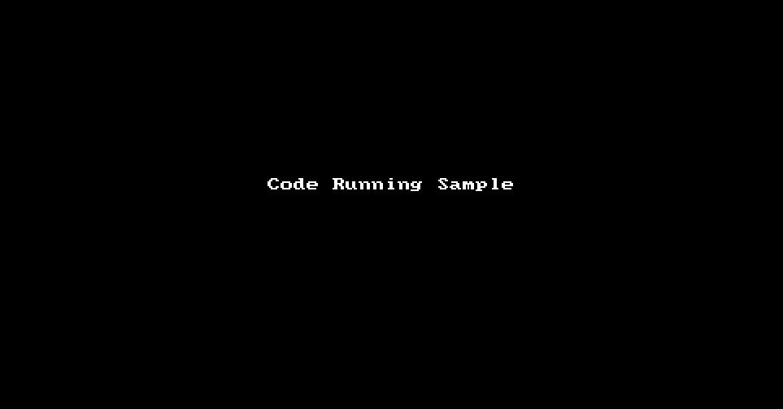
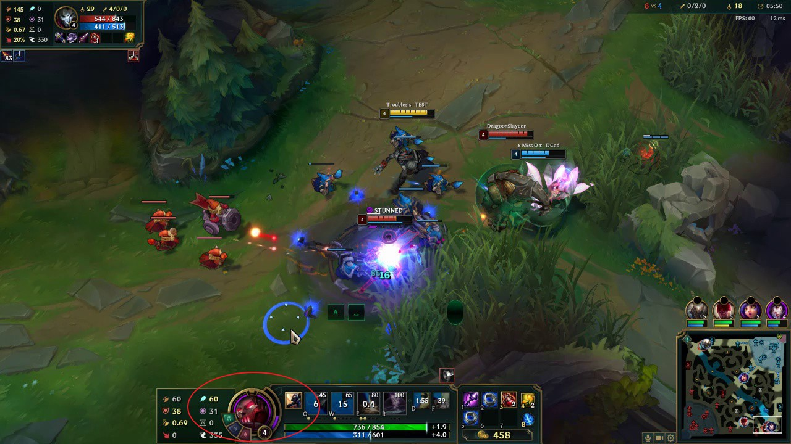

# LOL-Video-Auto-Category
Python script which will automatically sort League of legends videos base on the game mode and champion which was in the video.

I created a little python script which will automatically sort League of legends videos base on the game mode (currently only support normal / aram) and champion which was in the video. I am a new python learner and the code still has some issues. I am still happy it is partically working. Hope you will find this code is useful and hope you can help me to improve this code. Please let me knwo if you have any good ideas and give some advice on how to improve the code.

Note: While I am playing League of Lgends I always record the game by using Overwolf - GameSummary (https://www.overwolf.com/app/overwolf-game_summary) to automattically record the gameplays.
The app will automatically save the game in your local drive with folder name format as - League of Legends_DD-MM-YYYY_HH-mm-ss. Since the folder name does not show which champion I was playing, this is the reason why I create this code to help me to automatically detect which champion I was playing in the recorded videos.

=========================================

# Code Running Sample

# Info
The code is detecting champion based on the frame.jpg image capture from the detecting video and campare the champion icon in the image with the full champion icons library. If the image found match in the frame then the code will return the champion name.

frame.jpg  
 
championIcon.jpg

# To Do List
make champion detection function more accurate 
detect all champions in the video 
detect final kda in the video 
detect more game mode (eg. urf/teamfight tactics) 

# Known Issues
